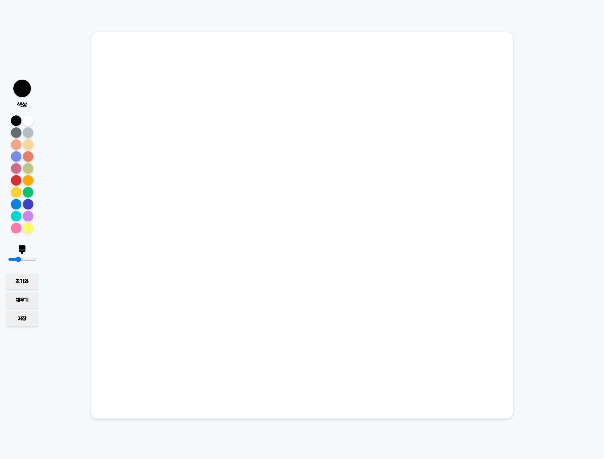
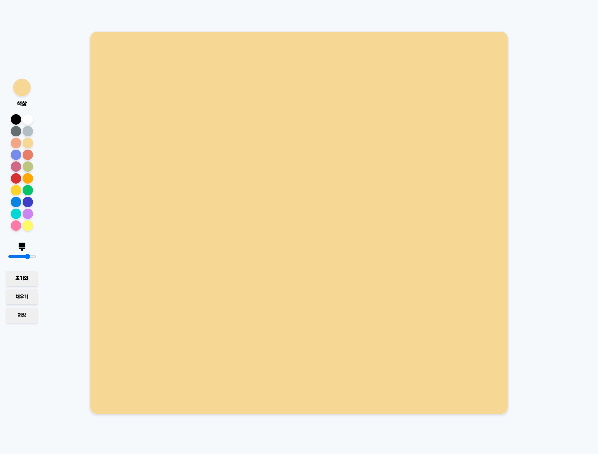

# Paint Board

## 🔗 Demo
https://githubgw.github.io/js-paint-board

## 🖥 Preview

## 🔥 Stack
### Front-end
  

## ✅ Packages
- [x] Javascript
- [x] Canvas
- [x] 2D Context
- [x] Pointer Events

## ⚙ Features
- [x] 2D Context
- [x] 2D Painting
- [x] Mouse Events
- [x] Brush Size
- [x] Image Save
- [x] Reset Paint Board
